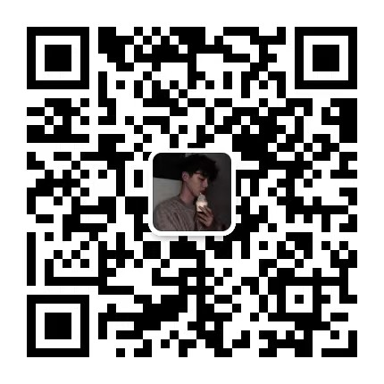

# MMIVQA 基线 🌟

<p align="center">
    
    
    
    
</p>


<p align="center">
  
</p>

## 欢迎来到 MMIVQA 基线代码仓库！

此仓库提供了解决 MMIVQA 挑战中任务的基线代码，包括 Track 1、Track 2 和 Track 3。以下是仓库内容概述以及如何使用基线代码进行训练和测试的说明。每个子项目都包含两个主要部分：环境配置和快速开始。请确保按照说明正确配置环境，并使用我们提供的示例代码进行训练和测试。祝你好运！😃

## 目录
1. [MMIVQA 概述](#mmivqa-概述)
2. [Track 1: mTAGSV](#track-1-mtagsv)
3. [Track 2/3: mVCR 和 mTAGVC](#track-2-3-mvcr-和-mtagvc)
4. [评测代码](#评测代码)
5. [问题和支持](#问题和支持)
6. [引用](#引用)
7. [微信群](#微信群)
8. [致谢](#致谢)

## MMIVQA 概述

多语言医疗教学视频问答（MMIVQA）挑战包含高质量的中英文医疗教学视频及专家标注。任务包括：
- Track 1: 单视频多语言时序答案定位（mTAGSV）
- Track 2: 多语言视频语料库检索（mVCR）
- Track 3: 视频语料库中的多语言时序答案定位（mTAGVC）

最终目标是开发一个系统，使用视频片段进行医疗教育中的多语言问答功能。

## Track 1: mTAGSV

此任务涉及使用自然语言问题在单个医疗教学视频中定位视觉答案。我们提出了一种跨模态相互知识转移跨度定位（MutualSL）方法来解决跨模态知识偏差。

详细的方法描述和实现请参考子目录中的 [README.md](https://github.com/WENGSYX/CMIVQA_Baseline/tree/main/task1)。

### 评测代码
[EVAL CODE](https://github.com/WENGSYX/CMIVQA_Baseline/tree/main/task1/eval.py)

## Track 2/3: mVCR 和 mTAGVC

这些任务专注于在大量未剪辑的视频语料库中定位视觉答案。我们将其分解为：
- 视频语料库检索（VCR）
- 视频语料库中的时序答案定位（TAGVC）

我们提出了一种跨模态对比全局跨度（CCGS）方法，结合视频语料库检索和视觉答案定位任务进行训练。

详细的方法描述和实现请参考子目录中的 [README.md](https://github.com/WENGSYX/CMIVQA_Baseline/tree/main/task23)。

### 评测代码
[EVAL CODE](https://github.com/WENGSYX/CMIVQA_Baseline/tree/main/task23/eval.py)

## 问题和支持

如果在环境部署或代码运行上遇到问题，请提出 [issue](https://github.com/WENGSYX/CMIVQA_Baseline/issues) 或联系：
- Yixuan Weng: [wengsyx@gmail.com](mailto:wengsyx@gmail.com)
- Bin Li: [libincn@hnu.edu.cn](mailto:libincn@hnu.edu.cn)

## 引用

如果在研究中使用了我们的代码，请引用以下论文：

```
@INPROCEEDINGS{10095026,
  author={Weng, Yixuan and Li, Bin},
  booktitle={ICASSP 2023 - 2023 IEEE International Conference on Acoustics, Speech and Signal Processing (ICASSP)}, 
  title={Visual Answer Localization with Cross-Modal Mutual Knowledge Transfer}, 
  year={2023},
  pages={1-5},
  doi={10.1109/ICASSP49357.2023.10095026}}

@INPROCEEDINGS{10096391,
  author={Li, Bin and Weng, Yixuan and Sun, Bin and Li, Shutao},
  booktitle={ICASSP 2023 - 2023 IEEE International Conference on Acoustics, Speech and Signal Processing (ICASSP)}, 
  title={Learning To Locate Visual Answer In Video Corpus Using Question}, 
  year={2023},
  pages={1-5},
  doi={10.1109/ICASSP49357.2023.10096391}}
```

## 微信群

由于人数较多，请添加微信好友邀请加入官方群（备注“NLPCC 2024”）。

<p align="center">
  
</p>

## 预祝！

祝你在 MMIVQA 比赛中取得好成绩！🏆🎉

---
